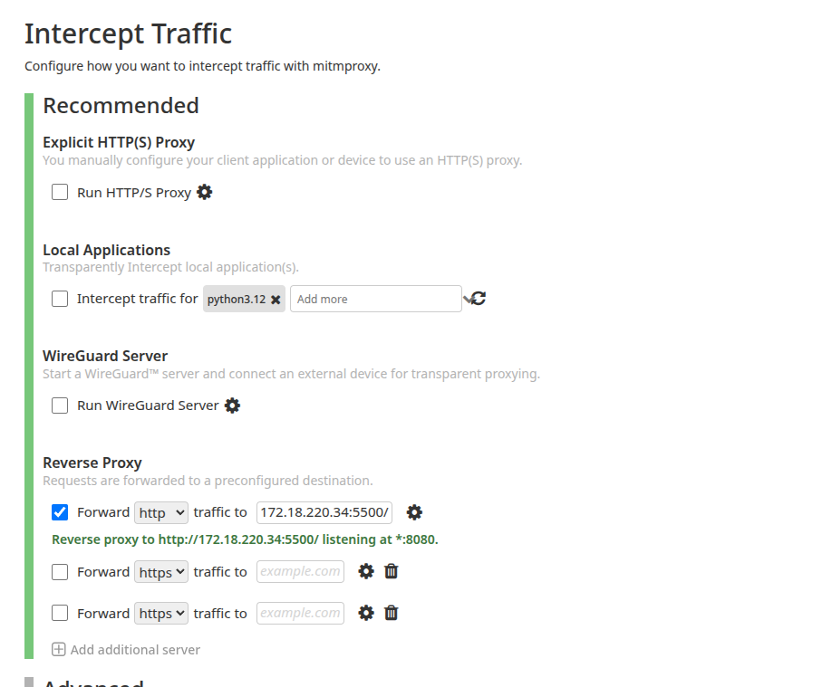
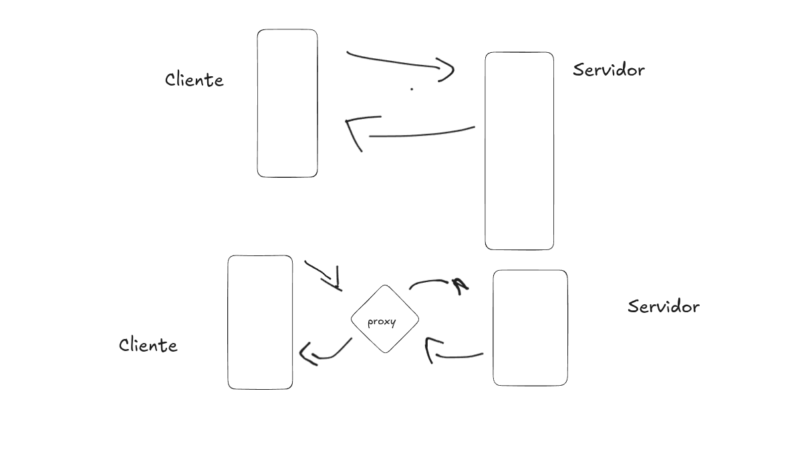

# trabalho-seg
mitmproxy


## Comandos para rodar o docker:


Configuração dockerfile:

[imagem docker](./mimtproxy/dockerfile)

```bash

   19  docker build -t mitmweb .
   20  docker run -it --rm   --name mitmweb   -p 8080:8080   -p 8081:8081   -v $(pwd):/workspace   mitmweb
   21  history

```


Após rodar o docker ele vai mostrar um token no terminal:

```bash
http://0.0.0.0:8081/?token=a723fff611f2d3d81ad03ef845716f4d

```


> A configuração do mitmproxy está pronta!!


## Servidor 

Seria interessante rodar um api,

mas criar um index.html, e rode o comando para subir:

```bash

cd servidor

ls

index.html


# comando para rodar o servidor:

 python3 -m http.server 5500


```


## Configuração na web:

Procura o ip da máquina

`ifconfig`

e coloca nas configurações do mitmproxy




## Após todas as configuração o sistema ficará assim:



